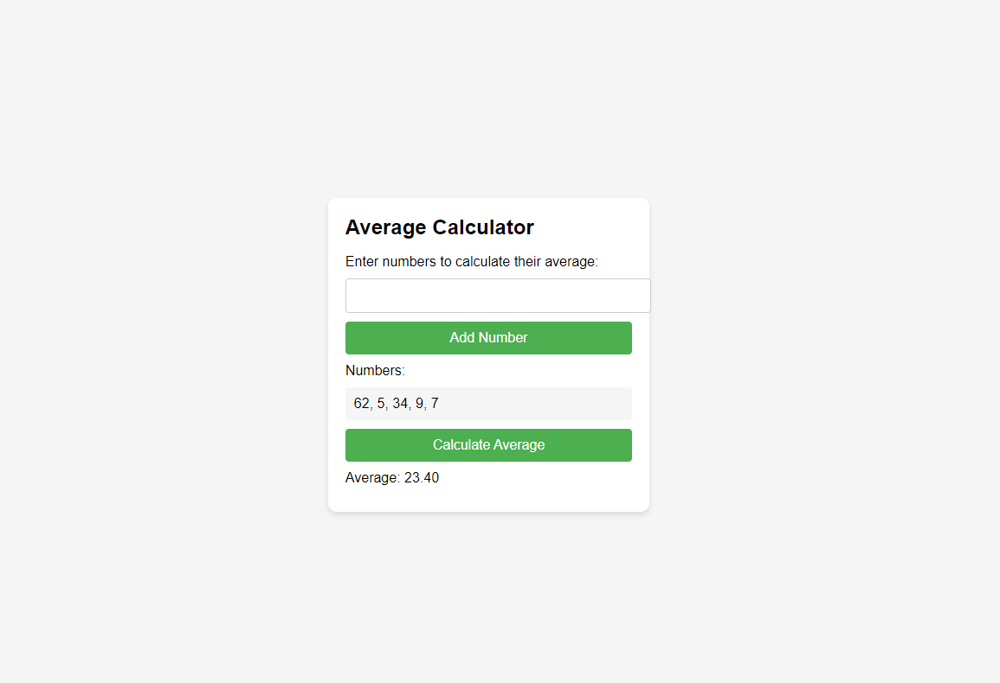

# average-calculator

A simple web-based calculator for calculating the average of a series of numbers.

## Features

-Enter any number of numberic values
-add values to the list with the "Add Number" button or by pressing "Enter" key
-Calculate and display the average of the entered numbers

## Setup

Clone this repository or download the project files (average_calculator.html, average_calculator.js, and average_calculator.css) to your computer

## Usage

Enter a number in the input field.
Click the "Add Number" button or press the 'Enter" key to add the number to the list.
Repeat steps 1 and 2 to add more numbers to the list
Click the "Calculate Average" buttonto calculate and display the averageof the entere numbers.

## License
